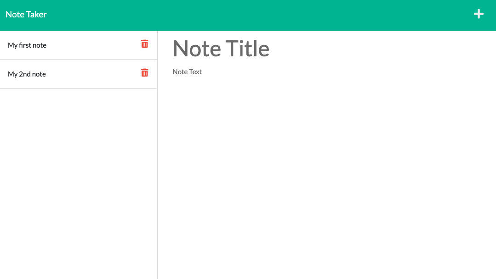

# Note Taker Organization Tool

## Description

A simple note creation application with the ability to enter and save task notes that are stored on a remote server for later retrieval. A great tool for keeping track of thoughts and tasks in an organized manner.

## Table of Contents

- [Installation](#installation)
- [Usage](#usage)
- [License](#license)
- [Contributing](#contributing)
- [Tests](#tests)
- [Questions](#questions)
- [Screenshot](#screenshot)

## Installation

Download a copy from gitHub.

## Usage

Anyone may download this code and then make changes for personal taste.

## License

This project not currently licensed.

## Contributing

Feel free to send me ideas on how to improve this app!

## Tests

N/A

## Questions

See more details at https://www.github.com/cduwors or contact christinaduwors@gmail.com.

## Screenshot

